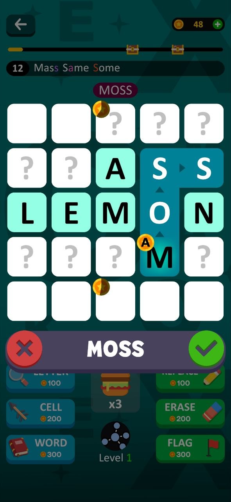

# Fill by Letter

A 5×5 word puzzle game where players place letters on the board
to discover valid words.

[GAMEPLAY GIF]

## About

Personal Unity project developed from scratch.
The game includes word validation, hints, bonuses, localization,
tutorials and automatic puzzle solving.

## Screenshots

## Technical Highlights

- Custom Trie implementation for efficient dictionary lookup
- Puzzle solver using grid traversal combined with Trie search
- Dependency injection with Zenject
- Asynchronous dictionary loading with UniTask
- Localization and asset management using Unity Addressables
- UI and gameplay animations with DOTween

## Tech Stack

Unity · C# · Zenject · UniTask · Addressables · DOTween

## Gameplay

[more screenshots / short GIF]

## Status

Playable prototype / Work in progress